# FLOWCHART SISTEM KLASIFIKASI TOMAT - DETAIL

## 1. ALUR UMUM SISTEM (HIGH LEVEL)

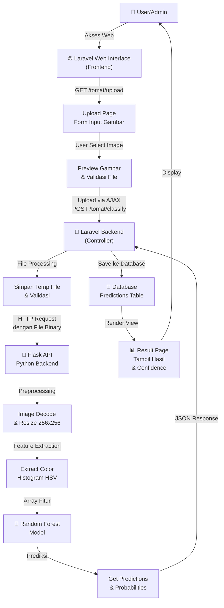

---

## 2. ALUR DETAIL: UPLOAD & KLASIFIKASI

```mermaid
graph TD
    START["🔵 START: User Upload"] -->|Klik Upload Button| A["1️⃣ FILE INPUT VALIDATION"]
    A -->|Check File Extension| B{Format Valid?<br/>PNG, JPG, JPEG, GIF}
    B -->|No| C["❌ Error: Invalid Format"]
    C --> END1["🔴 Show Error Message"]
    B -->|Yes| D{File Size<br/> ≤ 16MB?}
    D -->|No| C
    D -->|Yes| E["2️⃣ AJAX UPLOAD PROCESS"]
    
    E -->|FormData + File| F["Send POST /tomat/classify"]
    F --> G["3️⃣ LARAVEL BACKEND PROCESSING"]
    
    G --> H["Receive File Upload"]
    H --> I["Validate File Integrity"]
    I --> J["Temporary Save File"]
    J --> K["Prepare Request Body"]
    
    K --> L["4️⃣ PYTHON BACKEND REQUEST"]
    L -->|HTTP POST + File Binary| M["Flask App.py Receive"]
    M --> N["Parse File Stream"]
    
    N --> O["5️⃣ IMAGE PREPROCESSING"]
    O -->|cv2.imdecode| P["Decode Image dari Bytes"]
    P -->|Check Dimension| Q{Image Size<br/>256x256?}
    Q -->|No| R["cv2.resize → 256x256"]
    Q -->|Yes| S["Use As-Is"]
    R --> T["6️⃣ FEATURE EXTRACTION"]
    S --> T
    
    T -->|cv2.cvtColor| U["Convert BGR → HSV"]
    U --> V["Calculate Histogram<br/>8x8x8 bins per channel"]
    V --> W["Normalize Histogram"]
    W --> X["Concatenate Features<br/>into 1D Array"]
    X --> Y["Total Features: 192"]
    
    Y --> Z["7️⃣ MODEL PREDICTION"]
    Z -->|Loaded Model| AA["Random Forest<br/>Classifier"]
    AA -->|predict_proba| AB["Calculate Confidence<br/>for Each Class"]
    AB --> AC{Prediction<br/>Results}
    AC -->|Matang| AD["Kelas: MATANG"]
    AC -->|Mentah| AE["Kelas: MENTAH"]
    AC -->|Setengah Matang| AF["Kelas: SETENGAH_MATANG"]
    
    AD --> AG["8️⃣ PACKAGE RESPONSE"]
    AE --> AG
    AF --> AG
    AG -->|JSON Format| AH["Return:<br/>class,<br/>confidence %, <br/>timestamp"]
    
    AH --> AI["9️⃣ LARAVEL SAVE RESULTS"]
    AI -->|Store in DB| AJ["Predictions Table:<br/>user_id, filename,<br/>class, confidence,<br/>created_at"]
    
    AJ --> AK["🔟 RENDER RESULTS"]
    AK -->|JSON Response| AL["JavaScript:<br/>Update DOM"]
    AL --> AM["Display Result Card:<br/>Class, Confidence %,<br/>Advice Text"]
    AM --> AN["Show History Link"]
    AN --> END2["✅ COMPLETE"]
```

---

## 3. ALUR DATABASE & STORAGE

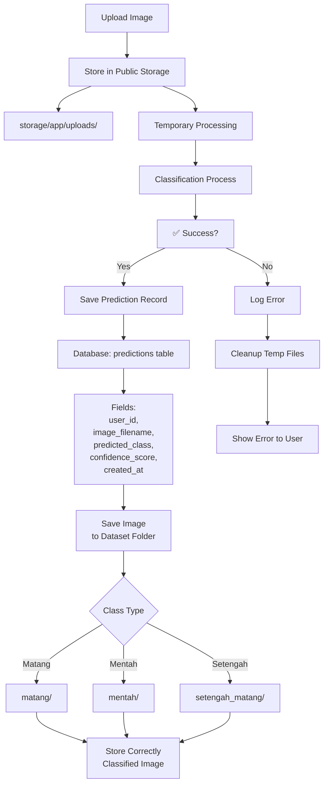

---

## 4. ALUR ADMIN DASHBOARD

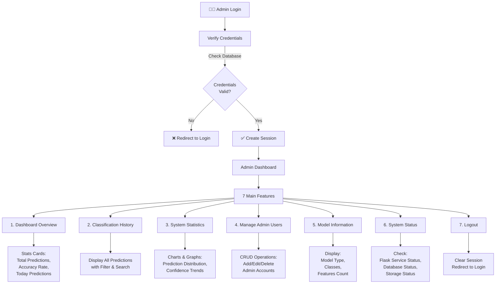

---

## 5. ALUR AUTENTIKASI ADMIN

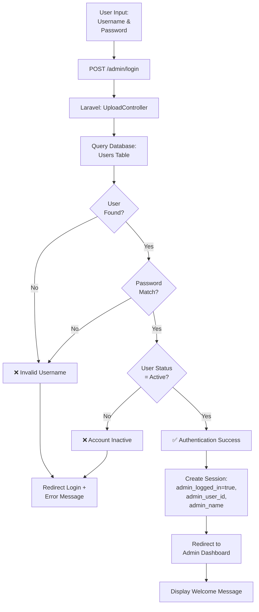

---

## 6. ALUR MODEL TRAINING (Background Process)

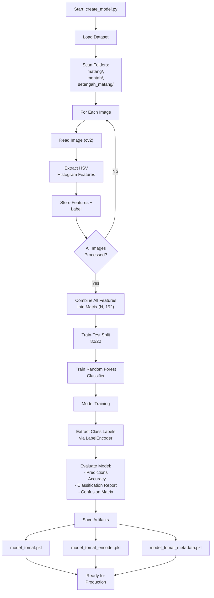

---

## 7. ALUR REQUEST-RESPONSE API PYTHON

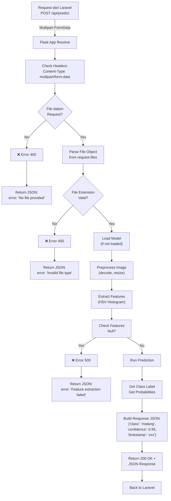

---

## 8. ALUR LAYERS ARSITEKTUR

```mermaid
graph LR
    A["PRESENTATION LAYER<br/>🎨"] --> B["HTML/CSS/JS<br/>Templates Blade"]
    B --> C["BUSINESS LOGIC LAYER<br/>⚙️"]
    
    C --> D["Laravel Controllers<br/>Route Handlers<br/>Validation"]
    D --> E["DATA ACCESS LAYER<br/>💾"]
    
    E --> F["Database<br/>Queries"]
    F --> G["External Services<br/>🔌"]
    G --> H["Flask API<br/>Python ML Backend"]
    H --> I["ML ENGINE LAYER<br/>🤖"]
    I --> J["Model Loading<br/>Feature Extraction<br/>Prediction"]
    
    J --> K["Model Files<br/>.pkl files"]
    K --> L["DATA LAYER<br/>💿"]
    L --> M["Datasets<br/>Database<br/>Storage"]
```

---

## 9. ALUR VALIDASI & ERROR HANDLING

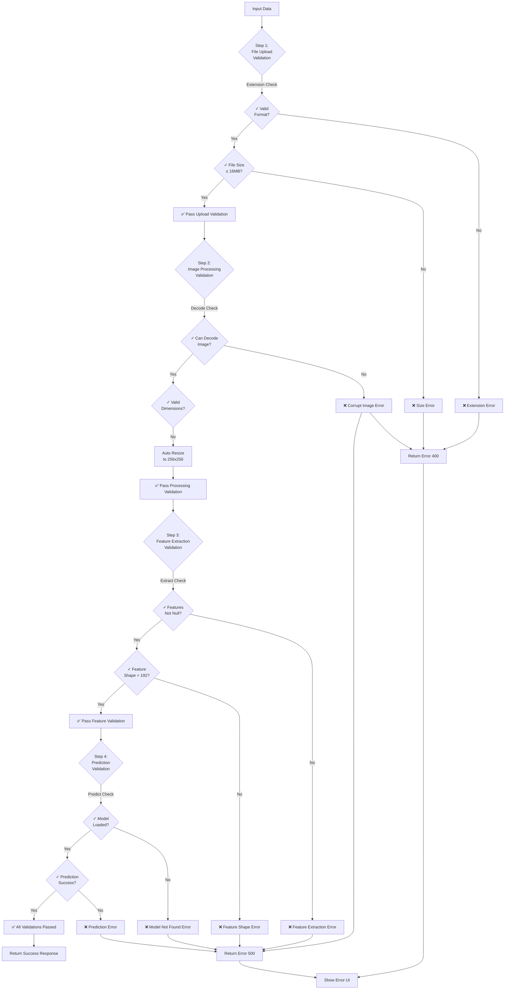

---

## 10. ALUR INTERAKSI USER-SISTEM

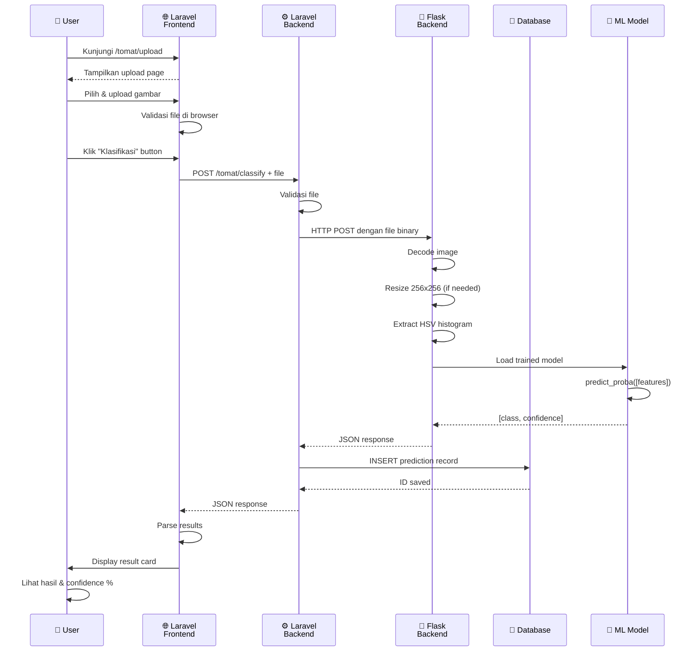

---

## 11. ALUR DATABASE SCHEMA

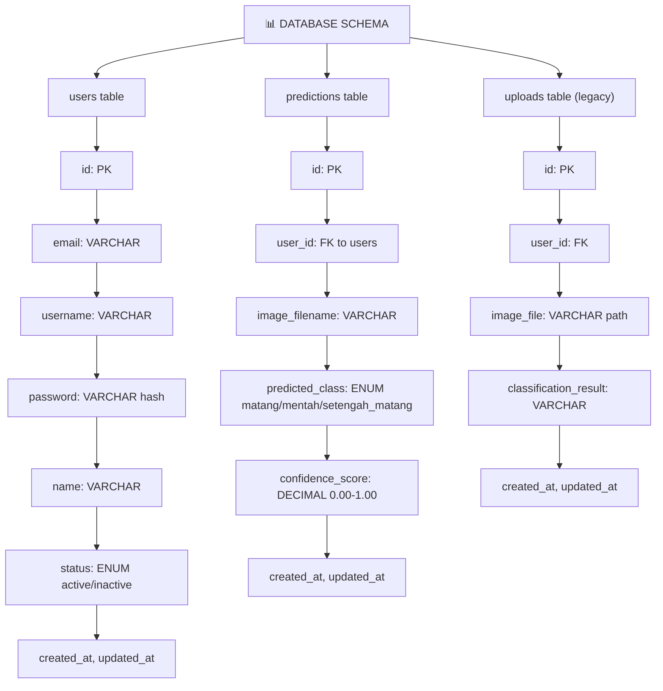

---

## 12. ALUR CACHE & PERFORMANCE

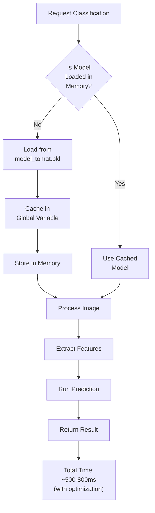

---

## 13. ALUR DEPLOYMENT & SETUP

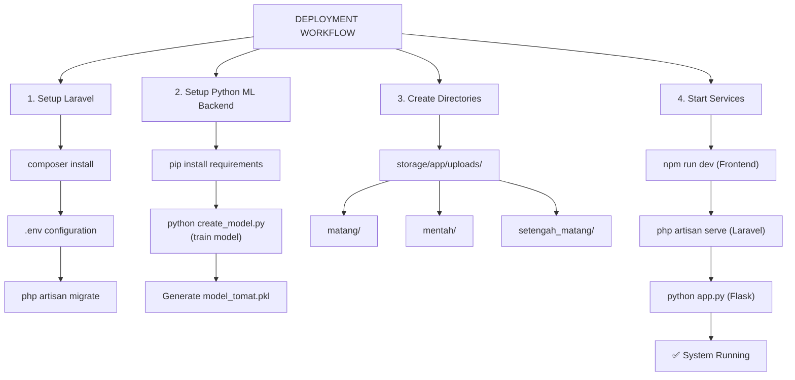

---

## 14. ALUR FITUR EKSTRAKSI (DETAIL TEKNIS)

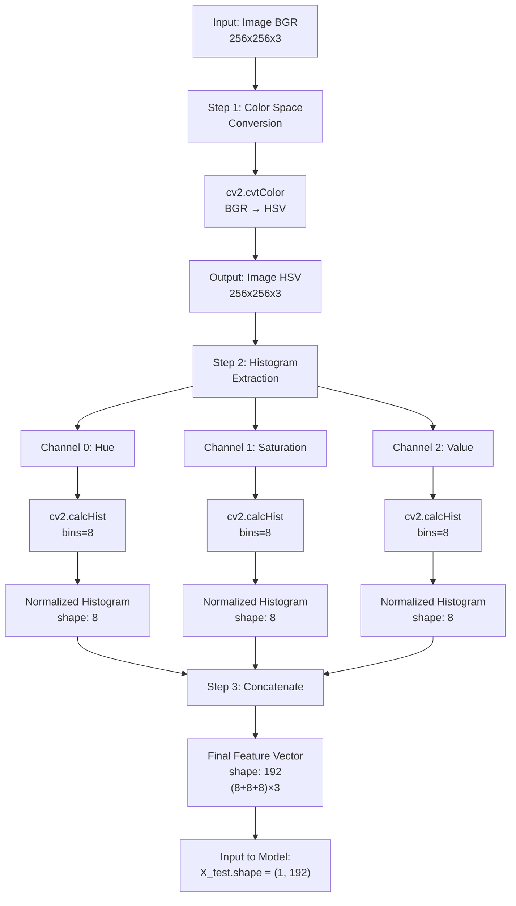

---

# RINGKASAN KOMPONEN SISTEM

| Komponen | Teknologi | Fungsi |
|----------|-----------|--------|
| Frontend | HTML/CSS/JS, Blade Template | User Interface, Upload Form |
| Backend Web | Laravel 11 | API, Database, Authentication |
| Backend ML | Flask, Python | Image Processing, Prediction |
| Model | Random Forest, joblib | Classification |
| Database | SQLite/MySQL | Store predictions, users |
| Features | HSV Histogram | Color-based classification |
| Classes | 3 (Matang, Mentah, Setengah Matang) | Tomato ripeness levels |

---

# TEKNOLOGI STACK

```
🎨 Frontend:
   └─ HTML5 / CSS3 / JavaScript (Vanilla)
   └─ Alpine.js (optional)
   └─ Blade Templating Engine

⚙️ Backend Web:
   └─ PHP 8.x
   └─ Laravel 11
   └─ Eloquent ORM
   └─ Laravel Routes & Controllers

🐍 Backend ML:
   └─ Python 3.8+
   └─ Flask (API Server)
   └─ OpenCV (cv2)
   └─ scikit-learn (ML)
   └─ NumPy (Numerical)
   └─ joblib (Model persistence)

💾 Database:
   └─ MySQL / SQLite
   └─ Migrations for versioning

📦 Deployment:
   └─ Apache / Nginx (Laravel)
   └─ Gunicorn / uWSGI (Flask)
```
